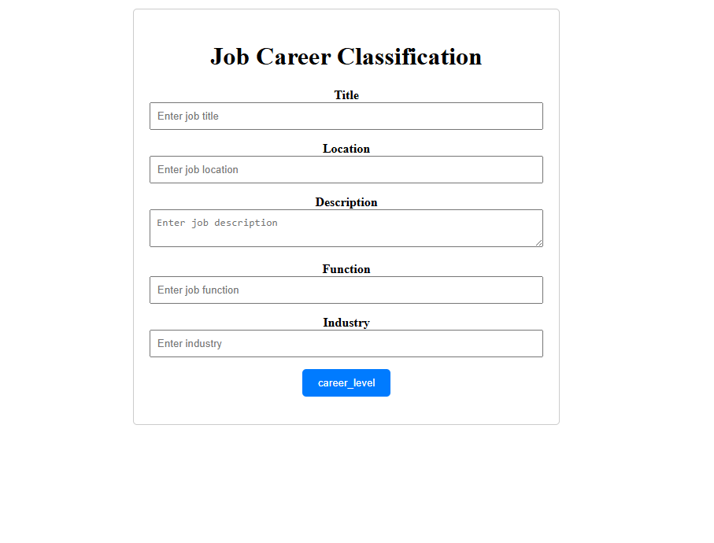
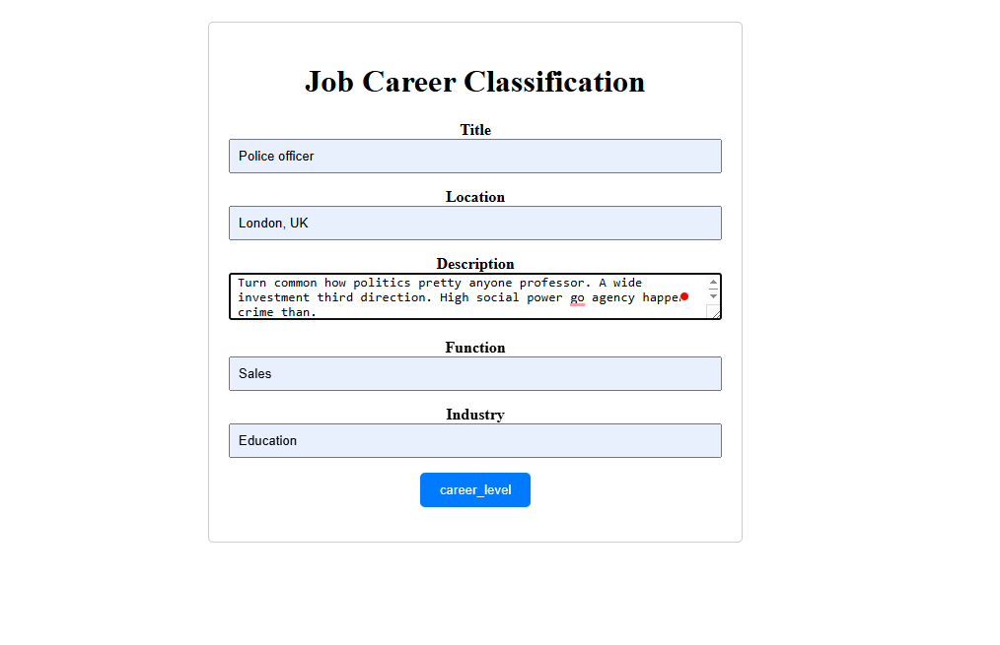
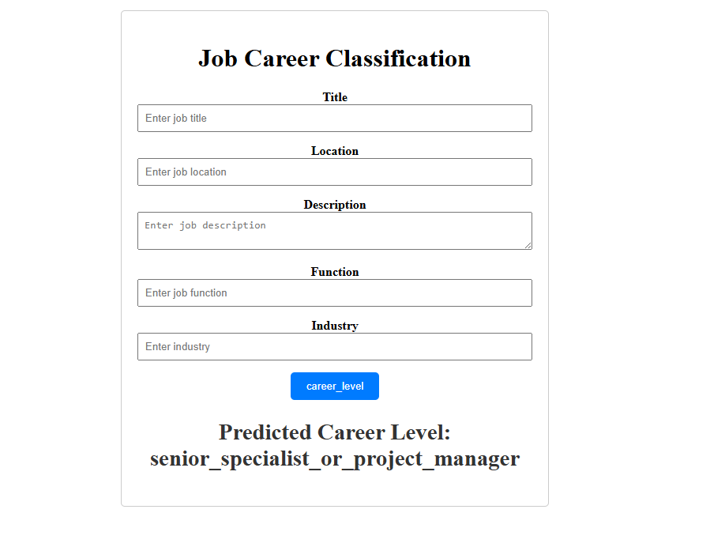

# Job Career Classification

Description : The job_dataset.csv is used in your job_classification project to train a machine learning model to predict the career_level of a job based on features like job title, location, description, function, and industry

Features :
    1. title (string): The job title (e.g., "Senior Software Engineer", "Marketing Manager")
    2. location (string): The job’s geographical location (e.g., "New York", "Berlin").
    3. description (string): A detailed text description of the job’s responsibilities and requirements.
    4. function (string): The job’s functional area or department (e.g., "Engineering", "Marketing").
    5. industry (string): The industry sector of the job (e.g., "Technology", "Healthcare").
    6. career_level (string, target variable): The target variable, representing the job’s seniority or hierarchical level.

# Deploy

Notice : recall_score(..., average='weighted')
